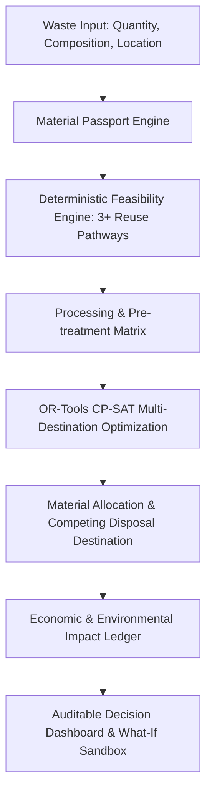

# RE:FLOW-X — Circular Resource Optimization & Decision Engine

RE:FLOW-X is an industrial waste-to-resource decision platform. It evaluates waste characteristics, verifies technical and environmental feasibility across multiple reuse pathways, allocates materials using constrained mathematical programming (**OR-Tools CP-SAT**), and generates an auditable, double-counting-free economic and environmental ledger against an explicit disposal baseline.

---

## 🏗️ System Architecture & Shared Flow



---

## 👥 Team Module Breakdown

* **Member 1 (Material Passport + Feasibility)**:
  * Waste characterization, chemical/physical profiling, contaminant thresholds.
  * Deterministic feasibility rules across $\ge 3$ distinct industrial reuse pathways (Cementitious SCM, Road Base Aggregate, Geopolymer/Mine Fill).
  * Parameter-level explainability audit trail (PASS/FAIL/MARGINAL with exact thresholds).
* **Member 2 (Processing + Optimization)**:
  * Facility registry, processing yield ($\eta$), energy/gate costs, residual rates.
  * Competing baseline disposal (landfill/incinerator) integration.
  * OR-Tools CP-SAT constrained optimization solver for multi-facility, capacity-constrained allocation.
* **Member 3 (Economic + Environmental Impact Ledger)**:
  * Dual-ledger accounting: Baseline vs. Optimized Reuse scenario.
  * Explicit Scope 1, 2, and 3 emissions + verified counterfactual avoided virgin material extraction.
  * Strict anti-double-counting validator & auditable calculation trace.
* **Member 4 (Frontend + Integration & Decision Engine UI)**:
  * Dynamic React + Vite + Tailwind + Recharts + MapLibre Decision Dashboard.
  * Multi-objective linear portfolio optimization UI & interactive spatial GIS command center.

---

## 💻 Tech Stack & Getting Started

### Frontend (React + Vite + TypeScript + Tailwind v4)
```bash
npm install
npm run dev
```

### Backend (FastAPI + Python 3.10+ + Pytest)
```bash
cd backend
pip install -r requirements.txt
pytest
```
