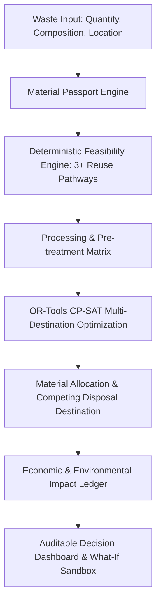

# RE:FLOW-X — Industrial Waste Reuse & Circular-Economy Optimization Platform

RE:FLOW-X is a decision-support and optimization platform designed for industrial waste streams. It evaluates waste characteristics, verifies technical and environmental feasibility across multiple reuse pathways, allocates materials using constrained mathematical programming (**OR-Tools CP-SAT**), and generates an auditable, double-counting-free economic and environmental ledger against an explicit disposal baseline.

---

## 🏗️ System Architecture & Shared Flow

---

## 👥 Team Module Breakdown

* **Member 1 (Material Passport + Feasibility)**:
  * Waste characterization, chemical/physical profiling, contaminant thresholds.
  * Deterministic feasibility rules across $\ge 3$ distinct industrial reuse pathways (Cement/Concrete SCM, Road Base Aggregate, Geopolymer Synthesis).
  * Parameter-level explainability audit trail (PASS/FAIL/MARGINAL with exact thresholds).
* **Member 2 (Processing + Optimization)**:
  * Facility registry, processing yield ($\eta$), energy/gate costs, residual rates.
  * Competing baseline disposal (landfill/incinerator) integration.
  * OR-Tools CP-SAT constrained optimization solver for multi-facility, capacity-constrained allocation.
* **Member 3 (Economic + Environmental Impact Ledger)**:
  * Dual-ledger accounting: Baseline vs. Optimized Reuse scenario.
  * Explicit Scope 1, 2, and 3 emissions + verified counterfactual avoided virgin material extraction.
  * Strict anti-double-counting validator & auditable calculation trace.
* **Member 4 (Frontend + Integration & What-If Scenarios)**:
  * FastAPI REST API orchestration endpoints.
  * Dynamic what-if scenario re-optimizer (carbon tax, fuel hikes, pre-processing, capacity shocks).
  * Interactive React + Vite + Tailwind + Recharts + MapLibre Decision Dashboard.

---

## 🌳 Branching Strategy & Git Protocol

* `main`: Protected production branch.
* `develop`: Active integration branch.
* Feature branches:
  * `feature/material-passport-feasibility` (Member 1)
  * `feature/processing-optimization` (Member 2)
  * `feature/impact-ledger` (Member 3)
  * `feature/api-scenarios` (Member 4 Integration)
  * `feature/frontend-dashboard` (Member 4 UI)

---

## 📜 Compliance & Transparency Notes

* **Synthetic Data Disclosure**: Reference baseline emission factors and technical thresholds are explicitly labeled as engineering benchmark defaults.
* **Double-Counting Prevention**: Secondary material credits are strictly partitioned from operational logistics and processing emissions, with bounded displacement ratios.
