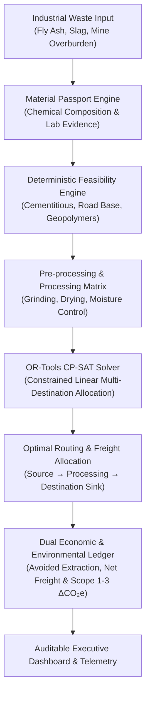

# 🌿 WasteManagement.in — Circular Resource Optimization & Enterprise Decision Platform

> **Powered by the RE:FLOW-X Decision Engine**  
> An industrial waste-to-resource intelligence system for industrial waste characterization, technical feasibility screening, OR-Tools CP-SAT multi-destination optimization, spatial logistics mapping, and auditable Scope 1-3 environmental accounting.

---

## 📸 System Showcase & Visual Interface Tour

| Screen / Portal | Interface Overview & Visual Design System |
| :--- | :--- |
| **Public Landing Page** | <br>• *Theme*: Environmental enterprise green (`#166534`), CTA accent orange (`#ea580c`), crisp typography.<br>• *Purpose*: Circular economy awareness, waste stream navigation, and seamless portal access. |
| **Portfolio Dashboard** | <br>• *Theme*: Clean white surface cards (`#f8fafc`), high-contrast dark slate text, active green highlights.<br>• *Features*: Real-time material flow, landfill diversion metrics (`9,820 t / 78.9%`), net cost tracking, and interactive Sankey flow. |
| **Materials Registry** | <br>• *Features*: Chemical passports, lab evidence completeness scores (`65% - 100%`), facility locations, and pathway readiness indicators (`READY`, `REVIEW`, `INCOMPLETE`). |
| **Spatial GIS & Maps Command Center** | <br>• *Features*: Regional logistics corridors, processing nodes, destination sinks, transport freight calculations, pre-processing costs, and feasibility verification badges. |

---

## 🏗️ System Architecture & Workflow



---

## 🛠️ Core Engineering Modules

### 1. Material Passport & Chemical Profiling (`Member 1`)
- **Chemical Passports**: Characterizes industrial byproduct streams (Fly Ash, Blast Furnace Slag, Copper Slag, Red Mud) by physical state, heavy metal presence, LOI, free lime, and moisture.
- **Feasibility Matrix**: Evaluates candidates across $\ge 3$ distinct industrial reuse pathways with exact parameter threshold validation (PASS / FAIL / MARGINAL).

### 2. Processing Matrix & CP-SAT Solver (`Member 2`)
- **Facility Yield Management**: Models processing yields ($\eta$), pre-treatment energy consumption, and secondary residual rates.
- **Mathematical Programming**: Powered by Google OR-Tools CP-SAT constraint solver to optimize multi-destination waste allocation under strict capacity, transport, and purity constraints.

### 3. Dual Economic & Environmental Impact Ledger (`Member 3`)
- **Baseline vs. Optimized Reuse**: Calculates net monetary savings and Scope 1, 2, and 3 emissions against traditional landfill/disposal baselines ($\Delta E = E_{\text{reuse}} - E_{\text{baseline}}$).
- **Anti-Double-Counting Ledger**: Ensures counterfactual avoided virgin material extraction is credited transparently without double-counting.

### 4. Enterprise Frontend & GIS Command Center (`Member 4`)
- **Unified Design System**: Enterprise environmental visual identity built with React, Vite, TypeScript, Tailwind CSS, and Recharts.
- **Interactive Spatial Network**: Topology graph and GIS corridor telemetry tracking transport distances, mass yields, and capacity verifications.

---

## 🚀 Quickstart Guide

### Prerequisites
- Node.js v18+ & npm
- Python 3.10+ (for FastAPI backend & CP-SAT solver engine)

### 1. Web Frontend Setup
```bash
# Install dependencies
npm install

# Run Vite dev server (runs on http://localhost:5173 or :5174)
npm run dev

# Run TypeScript build verification
npm run build
```

### 2. Backend Engine Setup
```bash
# Navigate to backend directory
cd backend

# Create & activate virtual environment (optional)
python -m venv venv
source venv/bin/activate  # On Windows: venv\Scripts\activate

# Install Python requirements
pip install -r requirements.txt

# Run backend API tests
pytest

# Launch FastAPI backend server
uvicorn main:app --reload --port 8000
```

---

## 🎨 Visual System Standards

- **Background**: Bright natural slate background (`#f8fafc`).
- **Primary Brand Color**: Industrial environmental green (`#166534` / `bg-green-600`).
- **Accent Action Color**: Vibrant orange CTA buttons (`#ea580c` / `bg-orange-600`).
- **Cards & Surfaces**: Pure white cards with subtle borders (`border-slate-200`) and soft shadows (`shadow-sm`).
- **Typography**: Crisp, dark slate readable typography (`text-slate-900` / `text-slate-800`).
