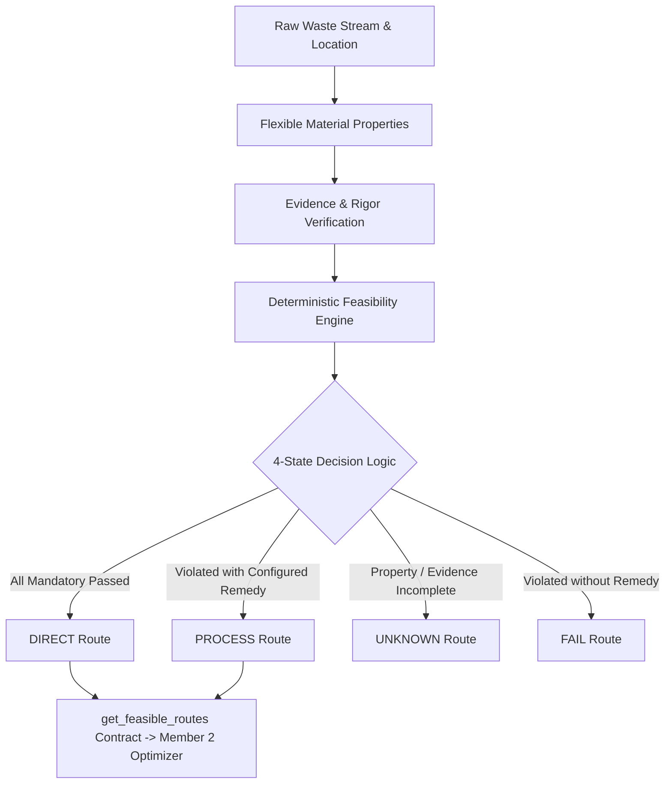

# RE:FLOW-X — Material Intelligence & Feasibility Engine
**Module Owner**: Member 1 (Material Intelligence + Feasibility Engine)  
**Branch**: `feature/member1-material-feasibility`  
**Target Integration Branch**: `develop`

---

## 1. Executive Architecture Overview

The **Material Intelligence & Feasibility Engine** is the foundational backend module of RE:FLOW-X. It accepts raw waste stream metadata and laboratory assays, characterizes material attributes into standardized physical/chemical indices, and deterministically evaluates compliance against configurable circular reuse pathways without relying on black-box heuristics or ML where engineering standards apply.



---

## 2. Database Schema

The database design uses SQLAlchemy with support for SQLite and PostgreSQL. Flexible properties avoid rigid schema migrations when new chemical assays or novel waste types are introduced.

### `materials`
| Column | Type | Constraints | Description |
|---|---|---|---|
| `id` | `VARCHAR(64)` | PRIMARY KEY | Unique waste stream code (e.g. `FA-001`) |
| `material_type` | `VARCHAR(64)` | NOT NULL, INDEX | Primary classification (`FLY_ASH`, `SLAG`, `MINE_WASTE`, extensible) |
| `material_name` | `VARCHAR(255)` | NOT NULL | Human-readable batch/facility name |
| `quantity_tonnes` | `FLOAT` | NOT NULL | Generation rate in metric tons |
| `location_name` | `VARCHAR(255)` | NOT NULL | Facility or origin name |
| `latitude` | `FLOAT` | NOT NULL | GPS latitude coordinate (-90 to +90) |
| `longitude` | `FLOAT` | NOT NULL | GPS longitude coordinate (-180 to +180) |
| `availability_start` | `DATE` | NULLABLE | Beginning of stream generation |
| `availability_end` | `DATE` | NULLABLE | End of generation window |
| `source_name` | `VARCHAR(255)` | NOT NULL | Production unit / origin process |
| `description` | `TEXT` | NULLABLE | Additional engineering notes |
| `created_at` | `DATETIME` | NOT NULL | ISO timestamp |
| `updated_at` | `DATETIME` | NOT NULL | Auto-updating ISO timestamp |

### `material_properties`
| Column | Type | Constraints | Description |
|---|---|---|---|
| `id` | `INTEGER` | PRIMARY KEY, AUTO | Surrogate key |
| `material_id` | `VARCHAR(64)` | FOREIGN KEY (`materials.id`) | Cascade on delete |
| `property_name` | `VARCHAR(64)` | NOT NULL, INDEX | Chemical / physical metric (e.g. `SiO2`, `SO3`, `LOI`, `moisture`) |
| `value` | `FLOAT` | NOT NULL | Measured numerical value |
| `unit` | `VARCHAR(32)` | NOT NULL | Standard unit (`%`, `g/cm3`, `um`, `ppm`) |
| `test_date` | `DATE` | NULLABLE | Laboratory test date |
| `evidence_type` | `VARCHAR(32)` | NOT NULL | Rigor tier (`LAB_VERIFIED`, `OBSERVED`, `SOURCE_BASED`, `MODELED`, `ASSUMED`, `SYNTHETIC`, `MISSING`) |
| `source` | `VARCHAR(255)` | NULLABLE | Laboratory or instrument name |
| `source_reference` | `VARCHAR(255)` | NULLABLE | Report / Certificate of Analysis number |
| `confidence` | `FLOAT` | NOT NULL, DEFAULT 1.0 | Statistical certainty (0.0 to 1.0) |
| `notes` | `TEXT` | NULLABLE | Explanatory remarks |

### `pathways`
| Column | Type | Constraints | Description |
|---|---|---|---|
| `id` | `VARCHAR(64)` | PRIMARY KEY | Code (`CEMENTITIOUS`, `BLOCKS_BRICKS`, `ROAD_INFRASTRUCTURE`, `MINE_FILL`) |
| `name` | `VARCHAR(255)` | NOT NULL | Descriptive name |
| `sector` | `VARCHAR(128)` | NOT NULL | Target industrial sector |
| `min_readiness_score` | `FLOAT` | NOT NULL | Minimum confidence required |
| `is_active` | `BOOLEAN` | NOT NULL, DEFAULT TRUE | Active flag |

### `pathway_requirements`
| Column | Type | Constraints | Description |
|---|---|---|---|
| `id` | `INTEGER` | PRIMARY KEY, AUTO | Surrogate key |
| `pathway_id` | `VARCHAR(64)` | FOREIGN KEY (`pathways.id`) | Target circular pathway |
| `property_name` | `VARCHAR(64)` | NOT NULL | Parameter evaluated |
| `operator` | `VARCHAR(16)` | NOT NULL | `LT`, `LTE`, `EQ`, `GTE`, `GT`, `BETWEEN` |
| `threshold_value` | `FLOAT` | NOT NULL | Lower or single threshold |
| `upper_threshold` | `FLOAT` | NULLABLE | Upper bound for `BETWEEN` |
| `unit` | `VARCHAR(32)` | NOT NULL | Standard unit |
| `requirement_type` | `VARCHAR(16)` | NOT NULL | `HARD` (mandatory), `SOFT` (advisory) |
| `required_evidence` | `VARCHAR(32)` | NOT NULL | Minimum evidence tier accepted |
| `standard_id` | `VARCHAR(64)` | FOREIGN KEY (`standards.id`) | Standard metadata link |
| `processing_remedy` | `VARCHAR(64)` | NULLABLE | Remedy if violated (e.g. `DRYING`, `GRINDING`) |
| `remedy_description` | `VARCHAR(255)` | NULLABLE | Actionable remediation procedure |

### `standards`
| Column | Type | Constraints | Description |
|---|---|---|---|
| `id` | `VARCHAR(64)` | PRIMARY KEY | `ASTM_C618`, `EN_450_1`, `IRC_SP20`, `SYNTHETIC_DEMO_REQUIREMENT` |
| `name` | `VARCHAR(255)` | NOT NULL | Standard title |
| `organization` | `VARCHAR(128)` | NOT NULL | Governing body |
| `version` | `VARCHAR(64)` | NOT NULL | Edition year / version code |
| `is_synthetic_demo` | `BOOLEAN` | NOT NULL | Transparency flag |
| `disclaimer` | `TEXT` | NOT NULL | Compliance notice |

---

## 3. Four-State Feasibility Logic

Every pathway evaluation strictly resolves to one of four mutually exclusive states:

1. **`DIRECT`**:
   * All mandatory (`HARD`) requirements are satisfied.
   * All observed evidence levels meet or exceed the required threshold evidence tier.
   * No pre-treatment is required. Candidate for immediate commercial diversion.

2. **`PROCESS`**:
   * One or more direct technical thresholds are violated, but every violated threshold has a configured `processing_remedy` (e.g., `moisture` > 3.0% can be resolved via `DRYING`; `fineness` > 34% can be resolved via `GRINDING`).
   * Feasible only when the destination processing unit or pre-treatment facility includes the required processing stage.

3. **`UNKNOWN`**:
   * A required property is missing from the material's assay, OR the observed evidence tier is insufficient (e.g., standard mandates `LAB_VERIFIED`, but only `ASSUMED` is provided).
   * **Crucial Rule**: Missing data is **NEVER** classified as `FAIL`. It is transparently reported as `UNKNOWN` with recommended testing actions.

4. **`FAIL`**:
   * A mandatory (`HARD`) requirement is violated and has **NO** configured processing remedy (e.g. high toxic heavy metal concentration, or sulfate content exceeding maximum chemical limits).
   * The route cannot be unlocked without modifying the raw generation process.

---

## 4. Evidence Pedigree Hierarchy

Evidence is treated as an ordered hierarchy of analytical certainty:

| Tier | Rank | Description | Permitted in Mandatory Hard Standards |
|---|---|---|---|
| `LAB_VERIFIED` | 5 | Accredited laboratory testing certificate (ISO/IEC 17025) | Yes |
| `OBSERVED` | 4 | Direct site sensor or real-time process monitoring | Yes (for civil/embankment) |
| `SOURCE_BASED` | 3 | Manufacturer Technical Data Sheet (TDS) / Mill Test Report | Conditional |
| `MODELED` | 2 | Computational thermodynamic / mass balance estimate | No |
| `ASSUMED` | 1 | Engineering literature benchmark | No |
| `SYNTHETIC` | 1 | Simulated benchmark for testing | No (Demo Only) |
| `MISSING` | 0 | No measurement recorded | No |

---

## 5. Stable Shared Contract for Member 2

Member 2 (Processing + OR-Tools CP-SAT Constrained Optimization) consumes the stable function:

```python
from backend.app.engine.routes import get_feasible_routes

routes = get_feasible_routes("FA-001")
```

**Returned Contract Structure:**
```json
[
  {
    "pathway_id": "CEMENTITIOUS",
    "status": "DIRECT",
    "required_processing": []
  },
  {
    "pathway_id": "BLOCKS_BRICKS",
    "status": "PROCESS",
    "required_processing": ["GRINDING"]
  },
  {
    "pathway_id": "ROAD_INFRASTRUCTURE",
    "status": "DIRECT",
    "required_processing": []
  },
  {
    "pathway_id": "MINE_FILL",
    "status": "DIRECT",
    "required_processing": []
  }
]
```

> **Contract Invariant**: Member 2 can safely filter on `status in ("DIRECT", "PROCESS")` and attach `required_processing` stages to the CP-SAT network formulation without breaking on schema changes.

---

## 6. REST API Reference

### Materials
* `POST /api/materials` — Register waste stream
* `GET /api/materials` — List waste streams (query: `material_type`, `skip`, `limit`)
* `GET /api/materials/{id}` — Fetch waste stream details
* `PATCH /api/materials/{id}` — Update stream attributes
* `DELETE /api/materials/{id}` — Remove waste stream
* `POST /api/materials/{id}/properties` — Add / update chemical or physical property
* `GET /api/materials/{id}/properties` — List recorded properties

### Pathways & Standards
* `GET /api/pathways` — List active circular pathways
* `GET /api/pathways/{id}` — Fetch pathway details
* `GET /api/pathways/{id}/requirements` — List technical rules and standards

### Feasibility Engine
* `POST /api/feasibility/check` — Evaluate material against pathway(s)
* `GET /api/feasibility/{material_id}` — Evaluate material against all active pathways
* `POST /api/feasibility/bulk-check` — Bulk evaluate multiple waste streams

---

## 7. Demonstration Seed Data Scenarios

The database includes four pre-seeded demonstration materials:

1. **`FA-001` (Class F Fly Ash)**:
   * Certified dry silo collection with low LOI (2.4%), low SO3 (0.75%), high SiO2 (53.4%).
   * Demonstrates: **`DIRECT`** on `CEMENTITIOUS`.

2. **`FA-002` (Lagoon Pond Ash)**:
   * Coarse ash with moisture = 8.5% (limit <= 3.0%) and fineness = 41.0% (limit <= 34.0%).
   * Demonstrates: **`PROCESS`** on `CEMENTITIOUS` with `required_processing: ["DRYING", "GRINDING"]`.

3. **`SL-001` (Blast Furnace Slag)**:
   * Missing critical sulfate and chloride lab tests.
   * Demonstrates: **`UNKNOWN`** on `CEMENTITIOUS` (missing data is never classified as FAIL).

4. **`MW-001` (Sulfide Flotation Tailings)**:
   * Excessive SO3 (15.2% > 5.0%) and arsenic (210 ppm > 50 ppm) without processing remedies.
   * Demonstrates: **`FAIL`** on `CEMENTITIOUS` and `MINE_FILL`.

---

## 8. Limitations & Assumptions

1. **Technical Screening, Not Regulatory Certification**:
   The engine acts as a deterministic decision-support tool. It does not replace formal environmental agency hazardous waste manifest certifications.
2. **Deterministic Evaluation**:
   Evaluation relies strictly on operator comparisons. Machine learning is intentionally avoided for core compliance checks to guarantee auditability and repeatability.
3. **Unit Consistency**:
   Properties must match requirement unit specifications (`%`, `ppm`, `g/cm3`). Unit conversion middleware can be extended in future iterations.
